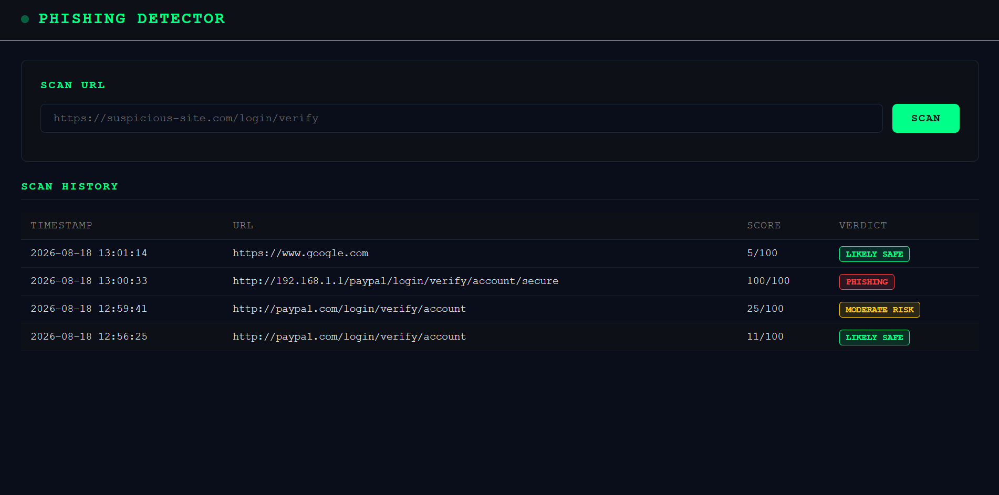
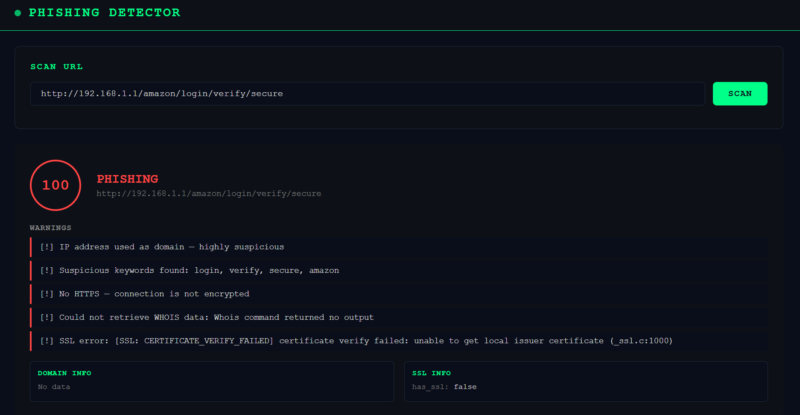

# Phishing Detector

A phishing URL detection tool built with Python, Requests, python-whois, and Flask. Analyzes URLs for phishing indicators including domain age, SSL certificate validity, suspicious keywords, and lookalike domains.

## Features

- URL structure analysis — detects IP-as-domain, suspicious keywords, lookalike domains, missing HTTPS
- WHOIS lookup — checks domain age, registrar, expiration date
- SSL certificate check — validates certificate, checks expiry and issuer
- Risk scoring — combines all signals into a 0-100 risk score
- Verdict system — LIKELY SAFE / MODERATE RISK / SUSPICIOUS / PHISHING
- Live web dashboard — scan URLs and view history with color-coded results
- CLI interface — scan single URLs or batch scan from a file

## Results

| URL | Score | Verdict |
|-----|-------|---------|
| https://www.google.com | 5/100 | LIKELY SAFE |
| http://paypa1.com/login/verify | 25/100 | MODERATE RISK |
| http://192.168.1.1/amazon/login/verify/secure | 100/100 | PHISHING |

## Dashboard Preview

## Live Scan Result

## Project Structure

    phishing-detector/
    ├── src/
    │   ├── url_analyzer.py    # URL structure and pattern analysis
    │   ├── domain_checker.py  # WHOIS domain age and registrar lookup
    │   ├── ssl_checker.py     # SSL certificate validation
    │   └── reporter.py        # Risk scoring and report generation
    ├── templates/
    │   └── index.html         # Flask dashboard UI
    ├── logs/                  # Scan history
    ├── main.py                # CLI entry point
    └── app.py                 # Flask dashboard entry point

## Installation

    git clone https://github.com/Stavros-Saridis/phishing-detector.git
    cd phishing-detector
    python -m venv venv
    venv\Scripts\activate
    pip install -r requirements.txt

## Usage

Scan a single URL:

    python main.py --url http://paypa1.com/login/verify

Scan multiple URLs from file:

    python main.py --file urls.txt

Start the dashboard:

    python app.py

Open browser at http://127.0.0.1:5003

## How It Works

The detector combines three analysis layers into a final risk score:

URL analysis checks for IP addresses used as domains, suspicious keywords (login, verify, secure, bank), lookalike domains impersonating known brands, missing HTTPS, special characters, and URL length.

WHOIS lookup checks domain age — newly registered domains are a major phishing indicator. A domain less than 30 days old adds 40 points to the risk score.

SSL check validates the certificate issuer and expiry. Missing or invalid SSL combined with other indicators pushes the score into PHISHING territory.

## Tech Stack

| Tool | Purpose |
|------|---------|
| Python 3.12 | Core language |
| Requests | HTTP requests |
| python-whois | Domain age and registrar lookup |
| ssl / socket | SSL certificate validation |
| Flask 3.1 | Web dashboard |

## Author

Stavros Saridis — BSc Computer Science (First Class Honours), University of Derby
MSc Cybersecurity student | Aspiring SOC Analyst
GitHub: https://github.com/Stavros-Saridis
LinkedIn: https://linkedin.com/in/stavros-saridis